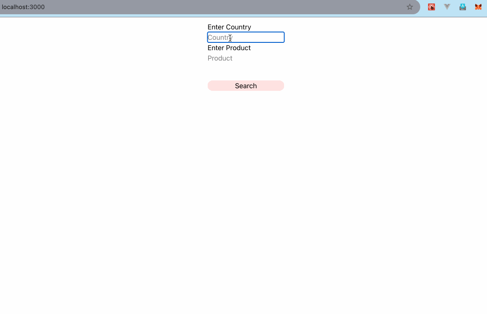
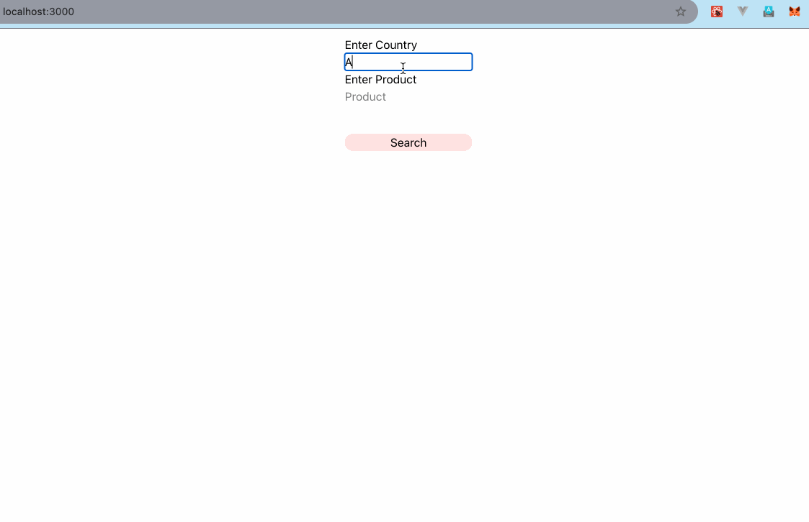

This is a Hiring Task for an AI x Commerce Startup

- The task is to implement a generic product link fetching tool based on the user's country.
- The tech stack here is NextJs and I am using Google's Gemini API to fetch the product information.
- You can find the prompt in `src/page.tsx`
- The task is deployed [here](https://ai-commerce-hiring-task.vercel.app/)

## Installing dependencies

Run the following command to install dependencies:

```bash
npm install
```
- External library used:
    - [react-json-view-lite](https://www.npmjs.com/package/react-json-view-lite)

## Running the development server

Run the development server with the following:

```bash
npm run dev
```

Open [http://localhost:3000](http://localhost:3000) with your browser to see the result.

## Demo

The task stated that a demo be displayed in the repo. Below are two GIFs demonstrating the product link fetcher.


### Demo for iPhone 16 Pro 

- Gemini Pro by default considered iphone 16 to be unreleased. The prompt was desinged to make it believe that it has been released.
- The prices are therefore skewed and the links can be broken too.




